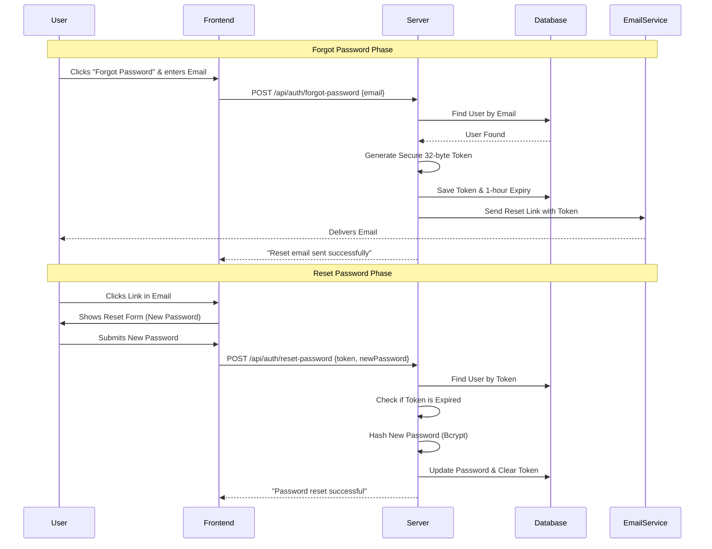

# Technical Documentation: Forgot & Reset Password System

This document provides a comprehensive, step-by-step technical breakdown of the **Forgot Password** and **Reset Password** functionality implemented in the Flight & Tour Travels API.

---

## 1. Feature Overview
The Forgot/Reset Password system allows users who have lost access to their accounts to securely regain entry by verifying their identity through email. 

### **Key Components**
- **Authentication Controller**: Logic for generating tokens and updating passwords.
- **Email Service**: For sending secure links to users.
- **Database Model**: Stores temporary reset tokens and their expiration times.
- **Security Protocols**: Uses cryptographic tokens and password hashing.

---

## 2. Workflow Diagram

---

## 3. Detailed Step-by-Step Breakdown (Line-by-Line)

### **Part 1: The Forgot Password API (`forgotPassword`)**
**Endpoint**: `POST /api/auth/forgot-password`

| Line | Code Snippet | Detailed Technical Explanation |
| :--- | :--- | :--- |
| **10** | `const { email } = req.body;` | **Input Extraction**: We pull the user's email from the request body. This is the only input required to start the process. |
| **12** | `const user = await User.findOne({ where: { email } });` | **Verification**: We query the PostgreSQL database using Sequelize to check if this email exists in our records. |
| **14-16** | `if (!user) { ... }` | **Security Check**: If the email doesn't exist, we return a `404 Not Found`. This prevents the system from processing requests for non-existent accounts. |
| **18** | `const token = crypto.randomBytes(32).toString("hex");` | **Token Generation**: We use Node.js's built-in `crypto` library to create a 32-byte random buffer, converted to a hexadecimal string. This is virtually impossible to guess. |
| **20-21** | `user.resetToken = token; user.resetTokenExpiry = ...` | **State Persistence**: We store the unique token in the user's database record. `Date.now() + 3600000` adds 1 hour (3.6m milliseconds) from the current moment. |
| **23** | `await user.save();` | **Database Update**: The token and expiry are synchronized with the database. |
| **25-26** | `const resetLink = ...` | **Link Construction**: We build a URL containing the token as a query parameter (`?token=...`). When the user clicks this, the frontend will capture the token. |
| **28-36** | `await transporter.sendMail({ ... });` | **Communication**: Using **Nodemailer**, we send an HTML email. This is the "bridge" between the server and the user's private inbox. |

---

### **Part 2: The Reset Password API (`resetPassword`)**
**Endpoint**: `POST /api/auth/reset-password`

| Line | Code Snippet | Detailed Technical Explanation |
| :--- | :--- | :--- |
| **51** | `const { token, newPassword } = req.body;` | **Input Collection**: The frontend sends the `token` (retrieved from the URL) and the user's `newPassword`. |
| **53-55** | `const user = await User.findOne({ ... });` | **Validation**: The server looks for a user who currently has that specific `resetToken` in the database. |
| **57-59** | `if (!user) { ... }` | **Integrity Check**: If no user matches the token, the request is rejected as "Invalid token." This prevents unauthorized password changes. |
| **61-63** | `if (user.resetTokenExpiry < Date.now()) { ... }` | **Expiration Check**: Even if the token is correct, if the current time is greater than the stored expiry, the link is dead. This limits the window of opportunity for an attacker. |
| **65** | `const hashedPassword = await bcrypt.hash(newPassword, 10);` | **Hashing**: We NEVER store plain-text passwords. `bcrypt` transforms the password into a secure hash with 10 salt rounds. |
| **67** | `user.password = hashedPassword;` | **Replacement**: The user's password field is updated with the new secure hash. |
| **68-69** | `user.resetToken = null; user.resetTokenExpiry = null;` | **Cleanup**: After success, we MUST delete the token and expiry. This ensures the reset link is "single-use" only. |
| **71** | `await user.save();` | **Final Sync**: The new password is saved, and the reset fields are cleared in the database. |

---

## 4. Security Highlights

1.  **Cryptographic Tokens**: We avoid using sequential IDs (like 1, 2, 3) which are guessable. `crypto.randomBytes(32)` provides 256-bit security.
2.  **Time-Bound Links**: By setting an expiry (1 hour), we ensure that even if someone intercepts an old email, they cannot use it to take over the account.
3.  **Password Hashing**: Even if the database is compromised, the user's real password remains protected because we only store the Bcrypt hash.
4.  **Single-Use Logic**: Clearing the token after the first successful reset prevents "Replay Attacks."

---

## 5. Configuration (Prerequisites)

For this system to work, the following environment variables must be defined in your `.env` file:
- `EMAIL_HOST`: The SMTP server (e.g., smtp.gmail.com).
- `EMAIL_PORT`: Usually 587 or 465.
- `EMAIL_USER`: Your service email.
- `EMAIL_PASS`: Your app-specific password.
- `EMAIL_FROM`: The display name the user sees in their inbox.
